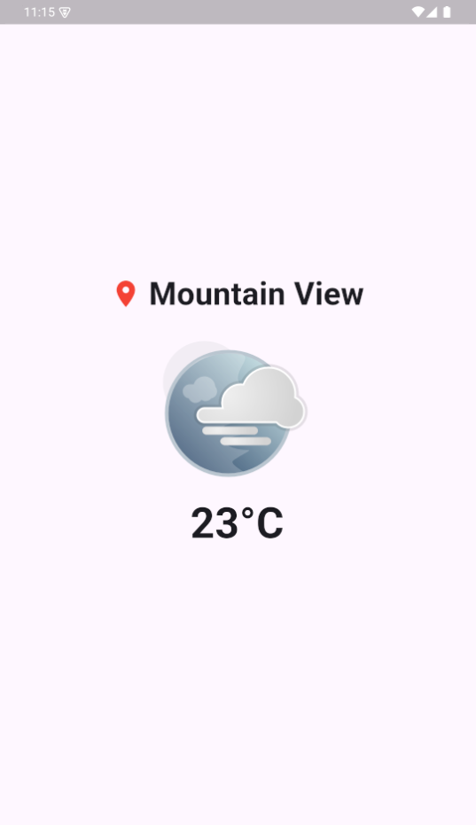

# Weather App

A simple and elegant Flutter weather application that displays current weather information based on the user's location.



## Features

- Automatically detects user's current city
- Displays current temperature
- Shows weather description with animated icons
- Clean and intuitive user interface

## Getting Started

### Prerequisites

- Flutter SDK
- Dart SDK
- An OpenWeatherMap API key

### Installation

1. Clone the repository:
   ```
   git clone https://github.com/yourusername/weather_app.git
   ```

2. Navigate to the project directory:
   ```
   cd weather_app
   ```

3. Install dependencies:
   ```
   flutter pub get
   ```

4. Replace the placeholder API key in `weather_service.dart`:
   ```dart
   final _weatherService = WeatherService('YOUR_API_KEY_HERE');
   ```

5. Run the app:
   ```
   flutter run
   ```

## Project Structure

- `lib/main.dart`: The entry point of the application
- `lib/models/weather_model.dart`: Defines the Weather data model
- `lib/pages/weather_page.dart`: Contains the main weather display page
- `lib/services/weather_service.dart`: Handles API calls and location services

## Dependencies

- `flutter`: The main framework
- `http`: For making API requests
- `geolocator`: For getting the device's location
- `geocoding`: For converting coordinates to city names
- `lottie`: For displaying weather animations

## API Used

This app uses the OpenWeatherMap API to fetch weather data. You'll need to sign up for a free API key at [OpenWeatherMap](https://openweathermap.org/api) to use this app.

## Contributing

Contributions are welcome! Please feel free to submit a Pull Request.

## License

This project is open source and available under the [MIT License](LICENSE).